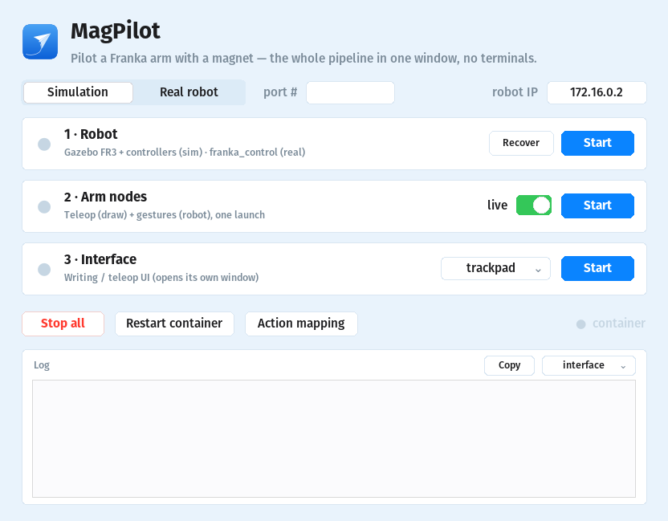
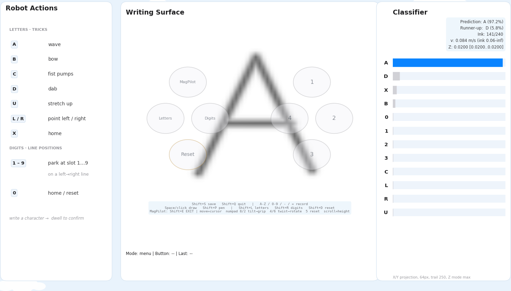
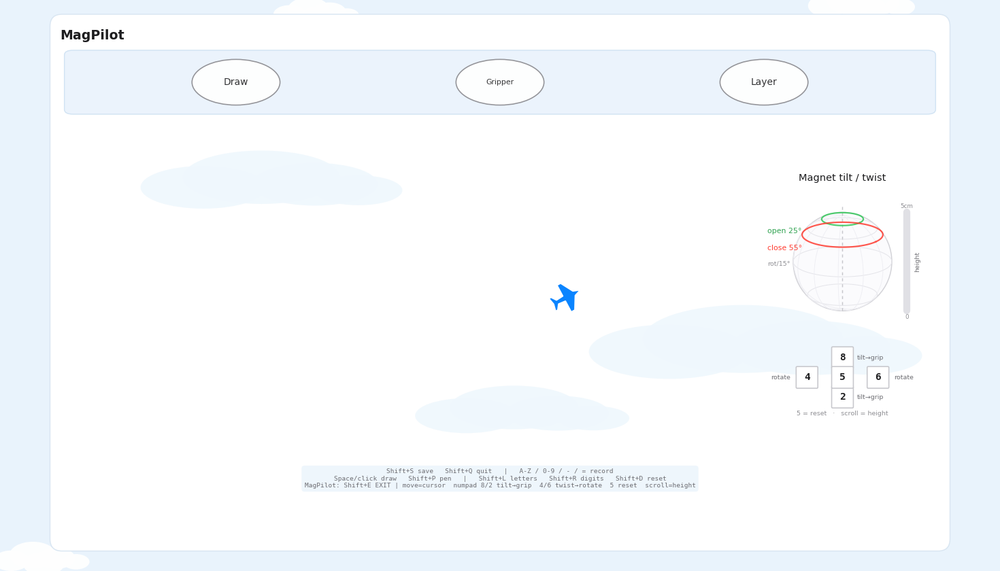

<div align="center">


<br><br>


**No joystick. No teach pendant. No code.**
A single magnet over a sensor board is the entire controller for a Franka FR3 —
air-write a character and the robot performs; pick the magnet up like a stick
and fly the arm in real time.

<sub>TUM seminar project (COLMAG) · full pipeline in simulation · staged path to the real robot</sub>

</div>

<br>

## Why a magnet?

Robot teleoperation usually means expensive hardware and a steep learning
curve. A permanent magnet costs cents, needs no battery, no pairing, no setup
ritual — and a small magnetometer grid tracks its **position, height, tilt
and twist** through the air. Five intuitive control channels, hiding in a
piece of metal. MagPilot turns them into a complete robot interface:

<div align="center">

| ✋ You do | 🤖 The robot does |
|---|---|
| ✍️ write `A`…`9` over the board | the mapped action — wave, bow, dab, or move to cube point *n* |
| 🕹 glide the magnet around | end-effector follows in real time |
| ↕️ raise / lower it (0.7–15 cm) | end-effector height follows |
| 📐 tilt past 55° / back under 25° | gripper opens / closes |
| 🔄 twist it while tilted at least 10° | end-effector rotates |
| ⬆️ lift above 15 cm | arm pauses — walk away safely |

</div>

## One window. Zero terminals.

<div align="center">

</div>

```bash
python3 colmag_launcher.py
```

The **Control Center** drives the whole stack inside Docker: robot, arm nodes
and interface each start with one button, and the status dots poll live.
Green = running · **amber = the Gazebo window was closed** (Start simply
reopens the window — it never launches a second sim into a running one) ·
the log pane streams whichever stage you select and can be selected or copied.
For the real sensor, select **magnetometer** first. The Interface log lists all
serial ports visible inside Docker; enter the matching number in **port #** and
then start the interface. The robot IP field at the top right remains editable
in either mode.

If Docker reports that it cannot open a serial port, reconnect the sensor and
run `COLMAG_SKIP_BUILD=1 bash ros/docker_setup.sh` once to recreate the
container from the existing image with hot-plug serial access enabled.

## Two modes, one surface

| ✍️ Writing studio | ✈️ MagPilot flight deck |
|:---:|:---:|
|  |  |
| Draw a character — it is inked live, classified when you pause, and the arm executes on confirm. | Dwell on **MagPilot**: your magnet becomes the little blue plane and the arm follows it. |

**Writing mode** — the legend beside the canvas shows the full mapping:

| Letter | Action | Digit | Action |
|:---:|---|:---:|---|
| `A` | wave 👋 | `1`–`8` | move to the eight corners of a 24 cm cube |
| `B` | bow 🙇 | `0` / `X` | home / reset |
| `C` | fist pumps 💪 | `9` | move to the cube center |
| `D` | dab 😎 | | *a 3D benchmark for the digit classifier* |
| `U` | stretch up 🙆 | `L` / `R` | point left / right |

**Flight deck** — the live gyroscope shows the magnet's tilt and twist against
the gripper thresholds, with a height gauge beside it. The top taskbar
(**Draw** = exit · **Gripper** · **Layer**) is button-only; everywhere else on
the deck is play area.

| Magnet input | Controls | Simulate on the trackpad |
|---|---|---|
| move over the board | end-effector X/Y | move the cursor |
| height over sensors (0.7–15 cm) | nonlinear end-effector height | mouse **scroll wheel** |
| lift above 15 cm | pause — arm holds | scroll to the top |
| tilt ≥ 55° / ≤ 25° | gripper open / close | numpad **2** / **8** |
| twist while tilt ≥ 10° (15° steps) | rotate the end-effector | numpad **4** / **6** |
| — | reset magnet upright | numpad **5** |

Switch modes any time — **even mid-motion**: entering MagPilot cancels the
running gesture, glides to a ready pose, then hands you the arm. `Shift+E`
bails out instantly and the arm returns to neutral.

## Under the hood

- **Sensing** — 48-channel magnetometer grid (218-byte packets @ 921600 baud);
  the dipole model recovers position + orientation (θ = tilt, φ = twist).
- **Recognition** — strokes are anti-aliased into a 64 px canvas with a
  velocity-hysteresis ink gate (slow corners stay connected) and classified
  by an OCR backend.
- **Motion** — damped least-squares IK streamed at 30 Hz with
  velocity-continuous trajectory points: the controller splines *through*
  the waypoints instead of braking at each one, so following is smooth.
- **Arbitration** — a latched ownership topic coordinates the gesture node
  and the teleop node; startup homing, mid-motion take-over and exit homing
  are all handled gracefully.

## Quick start

Needs Docker and a Linux desktop (X11). NVIDIA GPU optional.

```bash
git clone <this-repo> && cd COLMAG-seminar-SS26
xhost +local:root
INSTALL_GAZEBO=1 bash ros/docker_setup.sh   # build image + start container
python3 colmag_launcher.py                  # then Start 1 → 2 → 3
```

<details>
<summary><b>Manual commands</b> (alternative to the app)</summary>

Each terminal: `bash ros/docker_connect.sh`, then:

```bash
# 1 — robot (sim)
roslaunch colmag_ros fr3.launch controller:=effort_joint_trajectory_controller
# 2 — arm nodes (teleop + gestures)
roslaunch colmag_ros colmag_arm_nodes.launch dry_run:=false
# 3 — interface (trackpad sim; use --clean --writing-max-z 0.05 for the real sensor)
python3 magnetometer_reader.py --input-source trackpad --ros --classifier-labels ABCXLRUD0123
```
</details>

## Real robot — staged safety pipeline

Never skip stages. Move on only when the current stage behaves exactly as
expected; stop immediately on anything unexpected.

| Stage | What | Moves the real arm? |
|:---:|---|:---:|
| 1 | Everything in **Simulation** mode | No |
| 2 | Real sensor + ROS, arm nodes **dry-run** (uncheck *live*) | No |
| 3 | One tiny supervised nudge: `rosrun colmag_ros fr3_simple_move.py _dry_run:=false` | ✳ tiny, supervised |
| 4 | One approved gesture, then the full stack, then MagPilot | ✳ supervised |

Use the app's **Real robot** mode (runs `fr3_real.launch robot_ip:=…`). Keep
the E-stop reachable at all times.

<details>
<summary><b>Troubleshooting</b></summary>

| Symptom | Fix |
|---|---|
| Robot dot is **amber** | Sim runs but the Gazebo window is closed — press Start to reopen it. |
| Stage dot stays gray | Check that stage's log in the app's log pane. |
| `franka_control` is missing | Rebuild the full robot image: `INSTALL_GAZEBO=1 bash ros/docker_setup.sh`. |
| *"new node registered with same name"* | Two copies of a stage — **Stop all**, then start again. |
| Anything weird / stuck | **Restart container** (bulletproof reset). |
| GUI window doesn't open | `xhost +local:root` on the host once. |
</details>

## Repository map

```
colmag_launcher.py          MagPilot Control Center (run on the host)
magnetometer_reader.py      writing studio + MagPilot flight deck
colmag/                     interface building blocks (buttons, modes)
ros/colmag_ros/
  launch/fr3.launch              FR3 in Gazebo (+ practice objects)
  launch/fr3_real.launch         real FR3 connection
  launch/colmag_arm_nodes.launch teleop + gesture nodes together
  scripts/colmag_draw_node.py    MagPilot: cursor→EE, height, twist, gripper
  scripts/colmag_robot_node.py   gestures: letter tricks, digit cube, homing
tests/                      unit + smoke tests (run with python3 tests/…)
tools/                      calibration, CSV visualizer, logo/screenshot makers
docs/                       images + guides
```

---

<div align="center">


<sub>TUM Seminar · Collaborative Robotics and Assistive Technology for
Advanced Human-Robot Interaction</sub>

</div>
