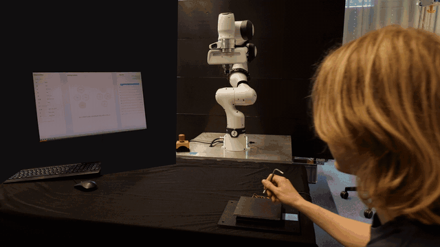
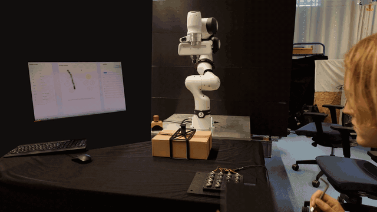
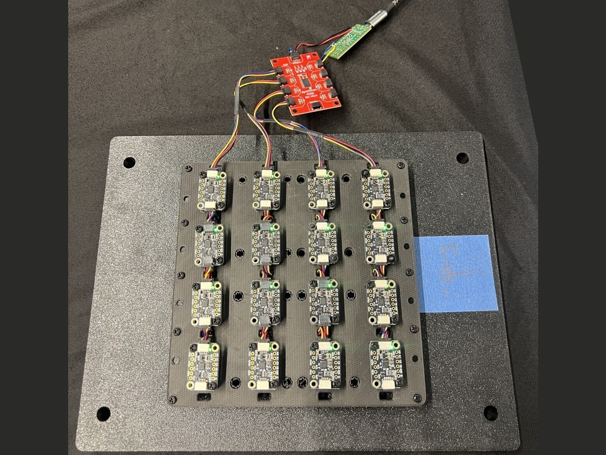
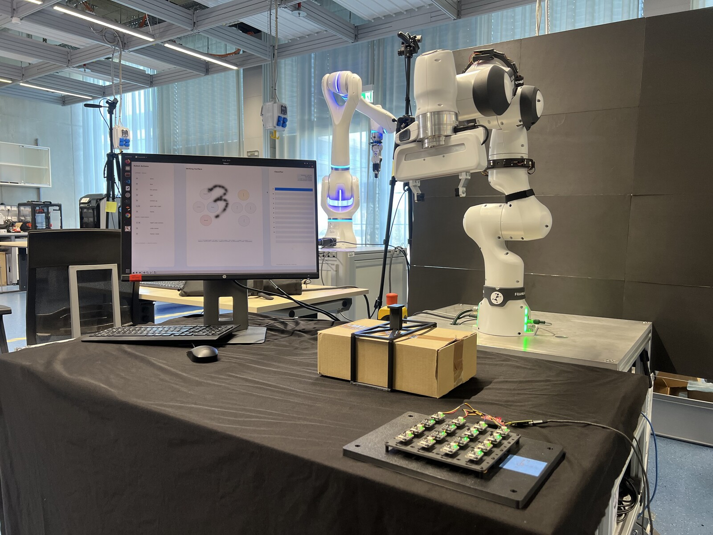
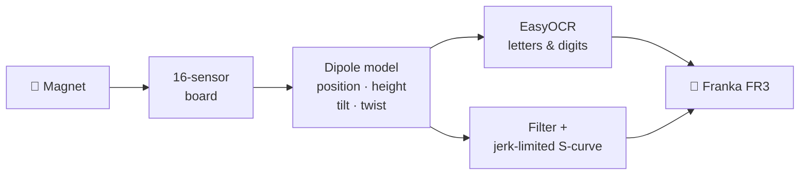

<div align="center">


<br><br>


**No joystick. No teach pendant. No code.**
A single magnet over a sensor board is the entire controller for a Franka FR3 —
air-write a character and the robot performs; pick the magnet up like a stick
and fly the arm in real time.

<sub>TUM seminar project (COLMAG) · full pipeline in simulation · staged path to the real robot</sub>

</div>

<br>

## Why a magnet?

Robot teleoperation usually means expensive hardware and a steep learning
curve. A permanent magnet costs cents, needs no battery, no pairing, no setup
ritual — and a small magnetometer grid tracks its **position, height, tilt
and twist** through the air. Five intuitive control channels, hiding in a
piece of metal. MagPilot turns them into a complete robot interface:

<div align="center">

| ✋ You do | 🤖 The robot does |
|---|---|
| ✍️ write `A`…`9` over the board | the mapped action — wave, bow, dab, or move to cube point *n* |
| 🕹 glide the magnet around | end-effector follows in real time |
| ↕️ raise / lower it (0.7–15 cm) | end-effector height follows |
| 📐 tilt past 55° / back under 25° | gripper opens / closes |
| 🔄 twist it while tilted at least 10° | end-effector rotates |
| ⬆️ lift above 15 cm | arm pauses — walk away safely |

</div>

## One window. Zero terminals.

<div align="center">

</div>

```bash
python3 colmag_launcher.py
```

The **Control Center** drives the whole stack inside Docker: robot, arm nodes
and interface each start with one button, and the status dots poll live.
Green = running · **amber = the Gazebo window was closed** (Start simply
reopens the window — it never launches a second sim into a running one) ·
the log pane streams whichever stage you select and can be selected or copied.
For the real sensor, select **magnetometer** first. The Interface log lists all
serial ports visible inside Docker; enter the matching number in **port #** and
then start the interface. The robot IP field at the top right remains editable
in either mode.

On startup the Control Center clears any pipeline processes left by an earlier
crash before enabling new starts. It also stops the former `colmag_ros`
container name, whose host-network ROS processes would otherwise appear inside
`colmag_simon`, and clears stale launcher logs after cleanup. Closing the
window, pressing `Ctrl+C`, or sending `SIGTERM` stops the interface and arm
nodes first, lets the arm controller settle, and then stops the robot backend.
A forced `kill -9` cannot run cleanup code, but the next startup still clears
its surviving processes.

If Docker reports that it cannot open a serial port, reconnect the sensor and
run `COLMAG_SKIP_BUILD=1 bash ros/docker_setup.sh` once to recreate the
container from the existing image with hot-plug serial access enabled.

## Two modes, one surface

<table>
  <tr>
    <th width="50%">✍️ Writing studio</th>
    <th width="50%">✈️ MagPilot flight deck</th>
  </tr>
  <tr>
    <td width="50%" align="center"></td>
    <td width="50%" align="center"></td>
  </tr>
  <tr>
    <td>Draw a character — it is inked live, classified when you pause, and the arm executes on confirm.</td>
    <td>Dwell on <strong>MagPilot</strong>: your magnet becomes the little blue plane and the arm follows it.</td>
  </tr>
</table>

**Writing mode** — the legend beside the canvas shows the full mapping:

| Letter | Action | Digit | Action |
|:---:|---|:---:|---|
| `A` | wave 👋 | `1`–`8` | move to the eight corners of a 24 cm cube |
| `B` | bow 🙇 | `0` / `X` | home / reset |
| `C` | fist pumps 💪 | `9` | move to the cube center |
| `D` | dab 😎 | | *a 3D benchmark for the digit classifier* |
| `U` | stretch up 🙆 | `L` / `R` | point left / right |

**Flight deck** — the live gyroscope shows the magnet's tilt and twist against
the gripper thresholds, with a height gauge beside it. The top taskbar
(**Draw** = exit · **Gripper** · **Layer**) is button-only; everywhere else on
the deck is play area.

<table>
  <tr>
    <th>🧲 Magnet input</th>
    <th>🤖 Robot response</th>
    <th>⌨️ Trackpad simulation</th>
  </tr>
  <tr>
    <td><strong>↔ Move</strong><br><sub>over the sensor board</sub></td>
    <td>End-effector X/Y</td>
    <td>Move the cursor</td>
  </tr>
  <tr>
    <td><strong>↕ Height</strong><br><sub>0.7–15 cm above sensors</sub></td>
    <td>Nonlinear end-effector height</td>
    <td>Mouse <strong>scroll wheel</strong></td>
  </tr>
  <tr>
    <td><strong>⏸ Lift</strong><br><sub>above 15 cm</sub></td>
    <td>Pause and hold pose</td>
    <td>Scroll to the top</td>
  </tr>
  <tr>
    <td><strong>◒ Tilt</strong><br><sub>open ≥ 55° · close ≤ 25°</sub></td>
    <td>Open / close gripper</td>
    <td>Numpad <kbd>2</kbd> / <kbd>8</kbd></td>
  </tr>
  <tr>
    <td><strong>↻ Twist</strong><br><sub>tilt ≥ 10° · 15° steps</sub></td>
    <td>Rotate end-effector</td>
    <td>Numpad <kbd>4</kbd> / <kbd>6</kbd></td>
  </tr>
  <tr>
    <td><strong>◎ Upright</strong></td>
    <td>Reset magnet reference</td>
    <td>Numpad <kbd>5</kbd></td>
  </tr>
</table>

Switch modes any time — **even mid-motion**: entering MagPilot cancels the
running gesture, glides to a ready pose, then hands you the arm. `Shift+E`
bails out instantly and the arm returns to neutral.

## See it in action

Running live on a Franka Research 3 — the only device the operator touches is a
magnet.

**✍️ Air-writing → the arm performs.** Write **A**, **B**, **D** on the board;
each is read and executed on the real arm.

<p align="center">
  <a href="docs/demo_classify.mp4">
    
  </a>
  <br>
  <strong><a href="docs/demo_classify.mp4">▶ Open 1080p player</a></strong>
  <br>
  <sub>Pause · scrub the timeline · audio</sub>
</p>

**✈️ Teleoperation → pick up a package.** Fly the arm by hand, then lower, grip
and lift the package.

<p align="center">
  <a href="docs/demo_teleop.mp4">
    
  </a>
  <br>
  <strong><a href="docs/demo_teleop.mp4">▶ Open 1080p player</a></strong>
  <br>
  <sub>Pause · scrub the timeline · audio</sub>
</p>

<sub>The full-length monochrome previews play directly on GitHub. GIFs cannot
provide playback controls; open either 1080p player for pause, timeline
scrubbing, and audio.</sub>

### The hardware

<div align="center">

| The sensor board | The workcell |
|:---:|:---:|
|  |  |
| A 4×4 grid of 16 off-the-shelf magnetometers on one breakout board — the whole "controller." | Robot, a flat sensor board, a magnet, and a screen. Nothing worn, nothing wired to the operator. |

</div>

> **Pitch deck.** A keynote-style presentation of the project lives in
> [`presentation/`](presentation/) (`MagPilot_Keynote.pptx`, 16 slides with
> speaker notes) — see [presentation/README.md](presentation/README.md) for the
> run-of-show and where the demo videos slot in.

## How it works



- **Sense** — a 4×4 grid of 16 magnetometers samples the field 30× a second; a
  dipole model recovers the magnet's position, height, tilt and twist.
- **Recognise** — air-written strokes are inked onto a canvas and classified
  into letters and digits by **EasyOCR**, each mapped to a robot action.
- **Move** — the noisy magnet signal is smoothed and jerk-limited before
  inverse kinematics streams it to the arm, so the real robot tracks your hand
  without vibration.

<details>
<summary><b>Engineering details</b></summary>

- **Sensing** — 48-channel magnetometer grid (218-byte packets @ 921600 baud).
  A configurable 10 mm sensor bias maps the observed 17 mm board-contact
  reading to the physical 7 mm board height; recorded CSV data stays raw.
- **Recognition** — strokes are anti-aliased into a 64 px canvas with a
  velocity-hysteresis ink gate (slow corners stay connected) before EasyOCR.
- **Motion** — damped-least-squares IK (analytic Jacobian, iteration-capped to
  stay inside the 33 ms tick) streamed at 30 Hz with velocity-continuous
  points, so the controller splines *through* the waypoints instead of braking
  at each one. Targets first pass a jerk-limited S-curve (0.12 m/s, 0.30 m/s²,
  1.50 m/s³). Segments are stamped on a uniform time grid so send-time jitter
  can't modulate their duration (the old "vibration while moving"), and each
  carries a look-ahead point so a late tick keeps gliding instead of stalling.
- **Height & twist filtering** — height uses a 1 mm noise gate and a
  distance-adaptive low-pass (250 ms near the board → 650 ms far), because the
  field falls off as ~1/r³ so distant readings are the noisiest. Wrist twist is
  off by default (`--enable-magnet-twist` re-enables its folded, rate-limited
  target) while physical oscillation is tuned; the visualiser always shows raw
  tilt/twist.
- **Arbitration** — a latched ownership topic coordinates the gesture and
  teleop nodes (startup homing, mid-motion take-over, exit homing), and latches
  MagPilot's enable state so restarting the arm nodes never drops following.

</details>

## Quick start

Needs Docker and a Linux desktop (X11). NVIDIA GPU optional.

```bash
git clone <this-repo> && cd COLMAG-seminar-SS26
xhost +local:root
INSTALL_GAZEBO=1 bash ros/docker_setup.sh   # build image + start container
python3 colmag_launcher.py                  # then Start 1 → 2 → 3
```

<details>
<summary><b>Manual commands</b> (alternative to the app)</summary>

Each terminal: `bash ros/docker_connect.sh`, then:

```bash
# 1 — robot (sim)
roslaunch colmag_ros fr3.launch controller:=effort_joint_trajectory_controller
# 2 — arm nodes (teleop + gestures)
roslaunch colmag_ros colmag_arm_nodes.launch dry_run:=false
# 3 — interface (trackpad sim; use --clean --writing-max-z 0.05 for the real sensor)
python3 magnetometer_reader.py --input-source trackpad --ros --classifier-labels ABCXLRUD0123
```
</details>

<details>
<summary><b>Real robot — staged safety pipeline</b></summary>

Never skip stages. Move on only when the current stage behaves exactly as
expected; stop immediately on anything unexpected. Use the app's **Real robot**
mode (runs `fr3_real.launch robot_ip:=…`) and keep the E-stop reachable.

| Stage | What | Moves the real arm? |
|:---:|---|:---:|
| 1 | Everything in **Simulation** mode | No |
| 2 | Real sensor + ROS, arm nodes **dry-run** (uncheck *live*) | No |
| 3 | One tiny supervised nudge: `rosrun colmag_ros fr3_simple_move.py _dry_run:=false` | ✳ tiny, supervised |
| 4 | One approved gesture, then the full stack, then MagPilot | ✳ supervised |

</details>

<details>
<summary><b>Troubleshooting</b></summary>

| Symptom | Fix |
|---|---|
| Robot dot is **amber** | Sim runs but the Gazebo window is closed — press Start to reopen it. |
| Stage dot stays gray | Check that stage's log in the app's log pane. |
| `franka_control` is missing | Rebuild the full robot image: `INSTALL_GAZEBO=1 bash ros/docker_setup.sh`. |
| Simulation and real robot both active | **Stop all** shuts down named ROS nodes across host-network containers; any survivor stays visible in the log without disabling the controls. |
| Gestures move but MagPilot does not | Check `rosparam get /use_sim_time`. The real launch forces `false`; a leftover `true` without Gazebo freezes ROS timers at zero. |
| FR3 reports **Reflex** / gripper works but arm does not | Release the activation device, unlock the joints in Franka Desk, confirm FCI, then click **Recover**. |
| *"new node registered with same name"* | Two copies of a stage from an older launcher — **Stop all**, then start each stage once. |
| Anything weird / stuck | **Restart container** (bulletproof reset). |
| GUI window doesn't open | `xhost +local:root` on the host once. |
</details>

## Repository map

<pre>
                         ☁   MAGPILOT FLIGHT MAP   ☁
                                      │
COLMAG-seminar-SS26/
├── <a href="colmag_launcher.py">colmag_launcher.py</a>              host control center and process lifecycle
├── <a href="magnetometer_reader.py">magnetometer_reader.py</a>          writing studio, flight deck, sensor and ROS bridge
├── <a href="colmag/">colmag/</a>                          interaction widgets, mappings and robot targets
├── <a href="digit_classifier/">digit_classifier/</a>                handwriting inference
├── <a href="ros/colmag_ros/">ros/colmag_ros/</a>
│   ├── <a href="ros/colmag_ros/launch/">launch/</a>
│   │   ├── <a href="ros/colmag_ros/launch/fr3.launch">fr3.launch</a>                 Gazebo FR3
│   │   ├── <a href="ros/colmag_ros/launch/fr3_real.launch">fr3_real.launch</a>            real FR3 connection
│   │   └── <a href="ros/colmag_ros/launch/colmag_arm_nodes.launch">colmag_arm_nodes.launch</a>   MagPilot and gesture nodes
│   └── <a href="ros/colmag_ros/scripts/">scripts/</a>
│       ├── <a href="ros/colmag_ros/scripts/colmag_draw_node.py">colmag_draw_node.py</a>        Cartesian MagPilot controller
│       ├── <a href="ros/colmag_ros/scripts/colmag_robot_node.py">colmag_robot_node.py</a>       gestures, digit cube and homing
│       └── <a href="ros/colmag_ros/scripts/colmag_sensor_node.py">colmag_sensor_node.py</a>      magnetometer serial bridge
├── <a href="presentation/">presentation/</a>                    keynote deck, generator and presentation media
├── <a href="tests/">tests/</a>                           unit, regression and lifecycle coverage
├── <a href="tools/">tools/</a>                           calibration, diagnostics and setup helpers
└── <a href="docs/">docs/</a>                            guides, screenshots and demo media
</pre>

---

<div align="center">


<sub>TUM Seminar · Collaborative Robotics and Assistive Technology for
Advanced Human-Robot Interaction</sub>

</div>
