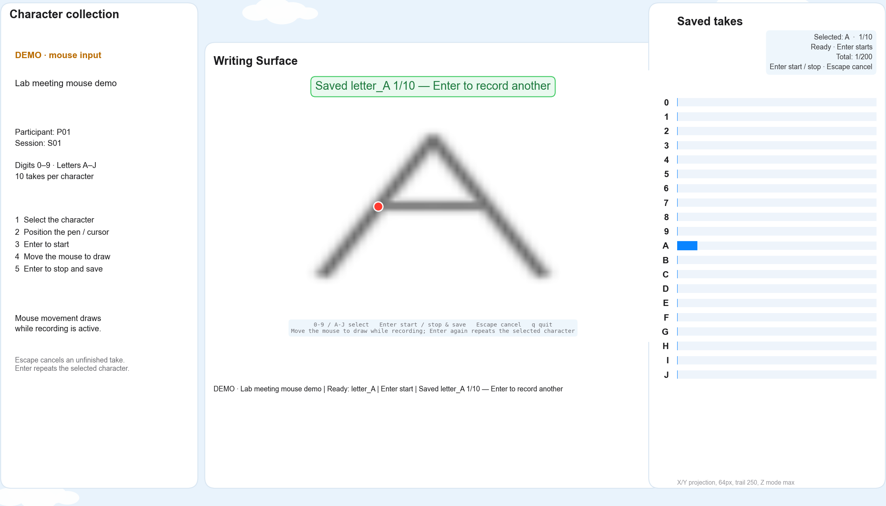

# Data collection

Start the launcher from the repository root:

```bash
python3 colmag_launcher.py
```

Open **Data**. The panel includes three recording workflows:

| Pipeline | Records | Guide |
| --- | --- | --- |
| Characters | Digits **0–9**, letters **A–J**; ten takes each | [Recording steps below](#character-recording) |
| Teleoperation | Random 3D targets; measured trajectory and completion time after a **2 s** hold | [MuJoCo and Gazebo setup](TELEOPERATION_COLLECTION.md) |
| Sensor Evaluation | **1 / 2 / 3 magnets × 3 runs**; five placements and a sweep | [Test procedure and placement guide](MAGNET_EVALUATION.md) |

Character and teleoperation workflows share experiment names and named participants.
Teleoperation includes participant progress, session totals and experiment history.
[View the Data panel](teleoperation_data.png).

## Character recording

1. Enter an **experiment name**, add the participant's name and press **Save**. Names appear alongside stable participant IDs in the coverage table.
2. Select **Sensor board** or **Demo (mouse)** and press **Start** beside the participant. Each Start opens a new numbered session.
3. Select a character with **0–9** or **A–J**, then position the pen or cursor.
4. Press **Enter** to start. Draw one character; press **Enter** again to stop and save **before lifting or repositioning**.
5. Press **Enter** to repeat the selected character, or choose another. **Escape** cancels an unfinished take.

The experimenter can select the character and press Enter while the participant only draws. No held key or mouse button is needed in the mouse demo.



The collection view shows the capture state, character preview and progress. Stopping freezes the samples before generating CSV, image and metadata. Gesture controls and OCR are disabled during collection; board captures include slow movements while preserving raw sensor values.

### Mouse demo

Docker must be running; neither a sensor board nor a robot is needed. Choose **Demo (mouse)** and follow the same Enter start/stop sequence. Mouse movement adds ink only during an active capture. A take with no drawing samples is discarded; optional blank/still controls are separate from the twenty-character protocol.

Demo files and coverage stay separate from real board recordings. The MuJoCo **trackpad** demo runs locally without Docker; see its [setup instructions](TELEOPERATION_COLLECTION.md#setup).

### Saved files

Recordings are stored in the gitignored `data_collection/` folder:

- **Board characters:** `data_collection/characters/Pxx/Sxx/`.
- **Mouse characters:** `data_collection/demo/characters/Pxx/Sxx/`.
- **MuJoCo trials:** `data_collection/teleoperation/Pxx/Sxx/`.
- **Sensor comparisons:** `data_collection/magnet_evaluation/<comparison-id>/`.

Character sessions contain a manifest, raw CSV and per-take CSV/PNG/JSON files. Participant/session IDs, experiment name, input source and protocol metadata accompany the recordings. See [teleoperation saved data](TELEOPERATION_COLLECTION.md#saved-data) for trial files and timing rules.

### Held-out evaluation

The selected character is the ground-truth label. The planned protected test set holds out **complete participants**, including all their sessions and takes. Keep labels and label-bearing filenames out of model inputs; fit preprocessing on training data, tune on validation data and freeze the pipeline before testing. The launcher does not enforce participant splits yet. [Evaluation plan](LAB_MEETING_PLAN.md#held-out-evaluation).

## Hardware and launcher controls

For board input, choose **magnetometer** in the main window and select the numbered serial port shown in its log. Close other board readers before collection. Enter the robot IP when using the real robot; character collection itself does not need the robot.

The Control Center starts and monitors the robot, arm controller and interface. Green means running; amber indicates simulation is active with the Gazebo window closed. Select a stage to view and copy its log; **Action mapping** edits the character-to-task vocabulary. Startup clears stale ROS processes, and closing the app shuts down the pipeline in order.

For teleoperation, Enter starts a target trial; the measured fingertip midpoint must remain inside the target continuously for the configured hold. Tracking interruptions hold the simulated arm and reset the loading ring; fresh valid tracking resumes the timed trial. Connection failures remain visible. [Full controls and recovery policy](TELEOPERATION_COLLECTION.md).

[Quick start and troubleshooting](../README.md#quick-start) · [Project plan](LAB_MEETING_PLAN.md) · [Weekly reports](reports/README.md)
