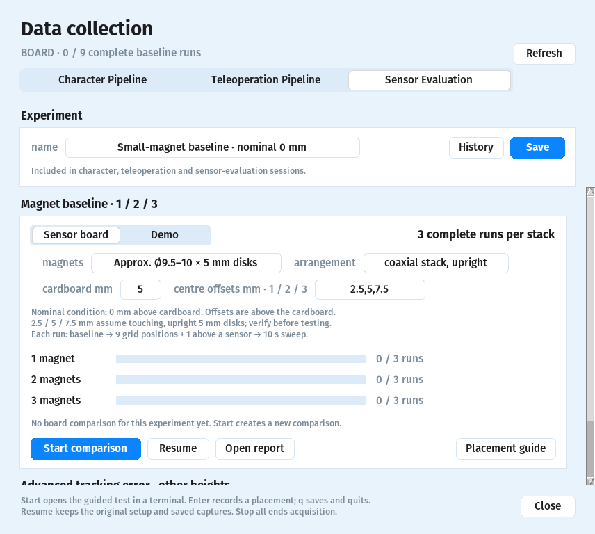

# Near-surface magnet comparison

**Goal:** choose a writing baseline from **1, 2 or 3 small magnets**, with **three complete runs per stack**. The physical comparison has not been performed yet.



## Setup

- Launcher → **Data → Sensor Evaluation**. Enter an experiment name; select **Sensor board**.
- Close the playground and other board readers before starting.
- Use identical, touching disks in an upright coaxial stack. Keep the same polarity, orientation and cardboard throughout.
- Nominal height: **0 mm above cardboard**. Enter the cardboard thickness separately: currently **approximately 5 mm** above the sensors.
- Current disk estimate: **Ø9.5–10 mm × 5 mm**. Measure the actual magnets and spacer before treating placement as ground truth.

| Stack | Centre above cardboard | Centre above sensors |
| --- | --- | --- |
| 1 magnet | ~2.5 mm | ~7.5 mm |
| 2 magnets | ~5 mm | ~10 mm |
| 3 magnets | ~7.5 mm | ~12.5 mm |

These offsets assume identical 5 mm disks, touching and upright. Enter **2.5,5,7.5** in **centre offsets mm · 1 / 2 / 3**, or leave unknown values blank/`?`; unknown offsets omit Z error.

## Record

- Open the [placement guide](magnet_evaluation_grid.svg). Print at **100% / Actual size**; verify the outline measures **150 × 150 mm**.
- Align the guide with the board centre and firmware +X/+Y axes. Transfer the marks onto the cardboard if preferred; preserve the measured surface gap.
- Press **Start comparison**. Follow the terminal prompts; **Enter** records each stage, **q** pauses between captures. **Resume** continues saved stages with the original setup.
- Each run: **2 s baseline**, all magnets ≥30 cm away → **nine grid positions**, each held still for **2 s** → **one above-sensor position** at **(+17.5,+17.5) mm**, also **2 s** → **10 s** slow square-and-diagonal trace. Each capture starts after **0.5 s settling**.
- Repeat orders: **1 → 2 → 3**, **2 → 3 → 1**, **3 → 1 → 2**. Rest the stack on the cardboard; centre it on each mark without tilting.
- Progress updates every **5 s**. A stack reaches **3/3** only after all three complete runs are saved.

## Compare and choose

- **Open report**: `report.md`, `comparison.svg`, `summary.csv` and `summary.json`; original samples remain in the run CSVs.
- Compare **XY/Z RMS error, XYZ jitter, poses in input range, baseline noise, signal strength, field peaks, packet rate/gaps and motion continuity** across all three repeats. Error includes finite outliers; jitter combines raw XYZ standard deviations at each fixed position.
- Raw fields retain firmware units. Constant channels during motion need inspection; they do not establish saturation.
- Z analysis retains the existing **abs(raw Z) − 10 mm** correction. This comparison does **not** recalibrate it; approximate offsets give approximate Z error.
- Select a repeatable near-surface baseline first. Then test greater teleoperation heights separately; additional magnets do not guarantee useful range.
- A later modular pen could accept **1–5 disks**. Measure diameter, insertion clearance and housing walls before CAD; choose the tested 1–3 baseline first.

Software-only rehearsal; synthetic results do not select a physical magnet:

```bash
python3 tools/record_magnet_evaluation.py --simulate --auto \
  --experiment-name "Magnet baseline demo" \
  --magnet "Approx. 9.5–10 × 5 mm disks" \
  --arrangement "coaxial stack, upright" \
  --centre-offsets-mm 2.5,5,7.5 \
  --output-dir /tmp/magpilot-magnet-demo
```
