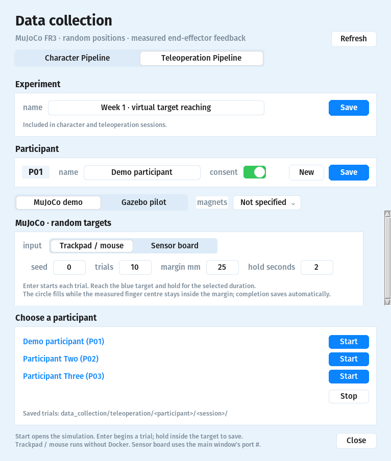
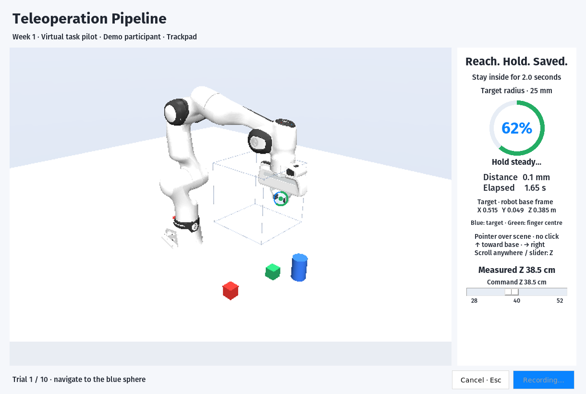

# Teleoperation Pipeline

Open **Data → Teleoperation Pipeline** and choose **MuJoCo demo** or
**Gazebo pilot**. Both use the shared experiment and named participant list.

For the random-target demo, select **MuJoCo demo → Start**.

- Shared experiment name and participant names from the collection registry.
- **Trackpad:** point at the visible target, then adjust height; no click or held button needed.
- **Height:** scroll anywhere in the task window, including the sidebar, in **1 mm steps**;
  alternatively use the sidebar slider (**28–52 cm**).
- **Position inset:** top view shows X/Y; the Z bar shows height. Blue is the target;
  green is the measured fingertip midpoint. The inset is a readout, not a control pad.
- **Magnet board:** board X/Y and calibrated magnet height control X/Y/Z.
- **Board readiness:** Enter requires a fresh pose inside the ±50 mm X/Y input area.
- **Tracking interruption:** lifted, outlying or stale estimates hold the robot and reset
  the loading ring. Fresh valid input resumes the same trial; wall time and the timeout continue.
  A serial connection failure ends and logs the attempt with its error message.
- **Enter:** reveal a random target and start timing from the common pose.
- **Hold:** keep the green fingertip midpoint inside the single blue target sphere for **2 seconds**.
- **Loading ring:** fills during the hold; leaving the sphere resets it.
- **Saved automatically:** Enter starts the next target. Escape cancels and logs the attempt.





The visible two-finger gripper makes the measured endpoint clear: the green
marker sits between its fingertips. The sidebar shows **commanded** and
**measured** height separately. Pointer movement over the sidebar, position inset
or empty image margins does not control the robot.

The scene pointer intersects the camera ray with the selected-height plane;
the resulting X/Y command is bounded by the workspace. Height changes keep the
last scene ray, so within the cube the tool remains under that scene point while
moving along the ray: X/Y can change together with Z. Before the first scene
movement, height controls retain the common start's X/Y. The inset exposes depth differences
that can be hidden when the two markers overlap in the main view.

## Recording progress

- **Named participant rows:** completed / planned targets, a progress bar and session count.
- **History:** select a recorded experiment; this sets the shared experiment field for viewing and new starts.
- **MuJoCo:** progress follows the selected input. Board and trackpad recordings stay separate.
- **Gazebo:** progress follows the selected condition; input totals use each run's recorded source.
- **Saved:** only valid, completed trials count toward progress. Cancelled and failed trials remain attempts.
- **Planned:** totals come from all matching session plans, including unfinished sessions; changing the next Start's batch size does not change them.
- **Refresh:** updates automatically every five seconds; the Refresh button updates immediately.

Progress is a recording inventory. Mixed protocols or setups show their counts;
use the matching controls and protocol rules below for performance comparisons.

## Setup

```bash
python3 tools/setup_teleoperation.py
python3 colmag_launcher.py
```

Tk must be available in the Python used for setup. The launcher uses
`.venv/teleoperation/bin/python`; `COLMAG_TELEOP_PYTHON` selects another runtime.
Trackpad trials run locally. Board trials reuse the existing Docker serial-port
setup; close other board recordings before starting.

Standalone trackpad demo:

```bash
.venv/teleoperation/bin/python tools/teleoperation_demo.py
```

## Pilot defaults

| Setting | Value |
| --- | --- |
| Position reference | Measured fingertip midpoint (`gripper_center`), in the robot base frame |
| Common start | X 0.45 / Y 0.00 / Z 0.40 m |
| Task workspace | Existing 24 cm cube in front of the robot |
| Random targets | 10, seed 0; target spheres fit inside the cube |
| Target radius | 25 mm; full 3D distance |
| Continuous hold / timeout | 2 / 60 seconds |
| Orientation | Fixed; position-only task |

The cube constrains both target generation and controls in this demo; scene
pointing does not enlarge it. Board axes and nonlinear height follow the
existing flight deck mapping, scaled to
this cube. Pick-and-place objects provide fixed visual landmarks.

## Saved data

Each Start creates `data_collection/teleoperation/Pxx/Sxx/` (gitignored).

- **manifest.json:** participant, experiment, input, magnet count, seed, settings,
  endpoint reference and control mapping.
- **summary.csv:** completion time, first entry, endpoint error, path length and status.
- **trial_NNN_trajectory.csv:** measured and commanded XYZ, both clocks, target error and input snapshots.
- **trial_NNN_result.json:** frozen trial result and protocol settings.

Time runs from Enter through the completed hold. Failed/cancelled trials retain
their status and have no successful completion time. Stationary commands alone
cannot earn a hold: the actual measured fingertip midpoint must stay inside the
target, with fresh physics feedback throughout. Input snapshots
include the latest board pose and 48 magnetic channels; they are sampled with the
robot trace rather than a full-rate sensor archive.
The trajectory's `input_valid` flag and input snapshot retain tracking interruptions,
raw outlying poses and their reasons. An interrupted hold cannot complete the target.
Session metadata records this recovery policy; compare like policies for timing studies.

New sessions use **protocol v2**, measuring `gripper_center` at the fingertip
midpoint. Historical **v1** files retain their flange reference. Keep v1 and v2
endpoint measurements separate in comparisons.

The scene mapping is recorded as **`scene_height_plane_v1`**, with normalized
image-pointer coordinates in the trace. Earlier trackpad sessions retain their
original full-canvas mapping; do not pool their speed measurements with scene
pointing trials without accounting for the changed controls.

Practice first. Keep seed, targets, tolerance and hold identical across input
conditions, and keep each condition's control mapping fixed. Plan condition
order and repetitions before collecting participant comparisons.

Before choosing the small-magnet pen, run the [near-surface comparison](MAGNET_EVALUATION.md)
in **Data → Sensor Evaluation**. That baseline evaluates writing-range behavior;
the full 15 cm teleoperation range needs its own later height comparison.

## Gazebo pilot in the same panel

Select **Gazebo pilot** in the Teleoperation tab. Set condition, margin, hold,
repetitions and notes, then press **Start** beside the participant's name.
Start **Simulation → Robot → Arm nodes → Interface** first. The pilot reads
the running Interface's input source; its controls and original protocol stay
in the existing robot workflow. See the [Gazebo instructions](VIRTUAL_TASK_PILOT.md).

The FR3 and Franka Hand models are vendored from MuJoCo Menagerie; see the
[arm source and license](../assets/teleoperation/franka_fr3/SOURCE.md) and
[hand source and license](../assets/teleoperation/franka_hand/SOURCE.md).
