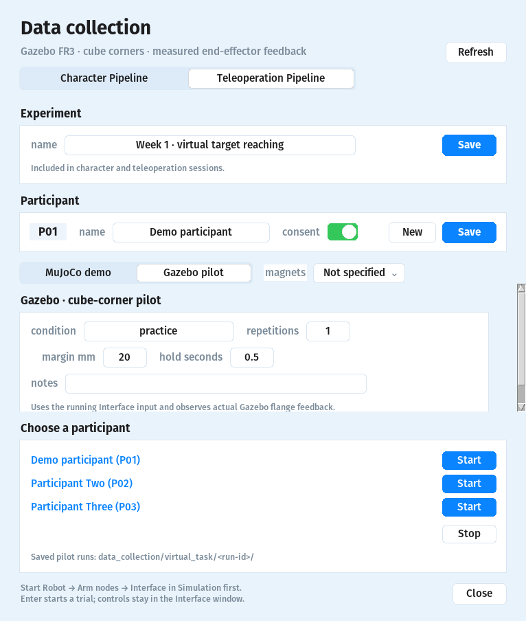

# Week 1 — virtual target-reaching pilot

For the integrated **Data → Teleoperation Pipeline** demo with random targets,
a loading ring and a two-second hold, use the
[MuJoCo collection instructions](TELEOPERATION_COLLECTION.md).
The instructions below describe **Gazebo pilot**, now selected in the same
Data panel.

Start the difficult robot task early: pilot the existing simulated FR3 to a
known Cartesian position, then record how long it takes and the remaining
end-effector position error. This is software and protocol scaffolding;
participant comparisons and measured performance are pending.

## Start in the launcher

1. Run `python3 colmag_launcher.py`; select **Simulation**.
2. Start **Robot → Arm nodes → Interface**. Keep **live** enabled for the
   simulated arm; choose **trackpad** or **magnetometer** for the actual input.
3. Enter MagPilot teleop in the Interface (Shift+E). For trackpad input, mouse
   motion controls X/Y and scrolling controls height.
4. Open **Data → Teleoperation Pipeline → Gazebo pilot**. Save the experiment
   and participant name. Enter a condition such as `practice`, `mouse`, or
   `magnet_stack_2`; set magnet count where relevant. Press **Start** beside
   the participant's name.
5. Return the measured flange to the common start **(0.45, 0.00, 0.40) m**.
   The pilot window shows the measured flange, target, and position error.
6. Hold at the common start until **Ready**, then press **Enter in the pilot
   window**. Move the simulated arm to the blue target using the Interface.
   Recording ends automatically after staying within tolerance for the hold.
7. Return to the same start for each target. **Escape** cancels a trial and
   permits retry; closing the pilot or pressing **Stop in Data** preserves its
   cancellation. Data's Stop leaves Robot and Interface running.



The recorder publishes **no arm commands** and refuses real `franka_control`,
missing Gazebo, stale flange TF, or a paused simulation clock. It runs beside
the Interface; selecting a condition labels the log and does not switch inputs.

## Default protocol and measures

| Setting | Pilot default |
| --- | --- |
| End effector | Flange (`fr3_link8`), in `fr3_link0` |
| Targets | Existing eight 24 cm digit-cube corners around the common start |
| Target tolerance / starting tolerance | 20 mm / 20 mm |
| Continuous target hold | 0.5 s |
| Timeout | 60 s wall time |
| Order / repetitions | Corners 1–8; one repetition |
| Completion time | Monotonic wall time from operator Enter through target hold |
| Position error | Euclidean distance between measured flange and target, in metres |

Keep targets, starting pose, tolerance, repetitions, controller limits, and
feedback identical when comparing conditions. Completion time is the primary
speed measure; simulation duration, sampled path length, and mean path speed
are also logged. A failed, timed-out, or cancelled trial has **no successful
completion time** and remains in the summary. Raw trajectories support later
checks of overshoot and controller behavior.

The position reference is the **flange**, not the gripper fingertip. This pilot
does not assess orientation or grasping. Defaults are provisional: practice
first, adjust target/tolerance if needed, then freeze them before collecting
comparative data. Counterbalanced condition order, a confirmed baseline,
practice trials, repetitions, and human study analysis are still to be designed.

The launcher reads the input source from the running teleop Interface process.
Changing the selector alone does not change that process; restart the Interface
when switching input conditions. Enter `practice` for initial software trials.

## Logs and commands

Every start creates a new directory under the gitignored
`data_collection/virtual_task/<run-id>/`:

- `manifest.json`: frames, units, targets, protocol, condition, magnet count,
  participant name and experiment name.
- `summary.csv`: every trial, completion status, time, endpoint error.
- `trial_NNN_trajectory.csv`: measured X/Y/Z, timestamps, target error.

Manual start inside the project container, after starting the simulated arm:

```bash
source /opt/ros/noetic/setup.bash
source /catkin_ws/devel/setup.bash
cd /colmag
python3 tools/target_reaching_pilot.py --participant-id P01 \
  --condition practice --input-source trackpad
```

Hardware-free plan check (no ROS, no measurement):

```bash
python3 tools/target_reaching_pilot.py --dry-run --run-id week1_plan
python3 tests/test_target_reaching.py
```

If Simulation reports missing `franka_gazebo`, the current Docker image lacks
the robot simulator. Build the full image from the project root with
`INSTALL_GAZEBO=1 bash ros/docker_setup.sh`, then reopen the launcher. The
recording-only image can run collection demos, but cannot measure a simulated
robot arm. Do not substitute cursor or commanded position for robot feedback.

Board repair and magnet-stack tracking checks are separate from this task.
Record stacks of **1 / 2 / 3 smaller magnets** as different conditions only
after checking that each stack gives usable pose feedback.
