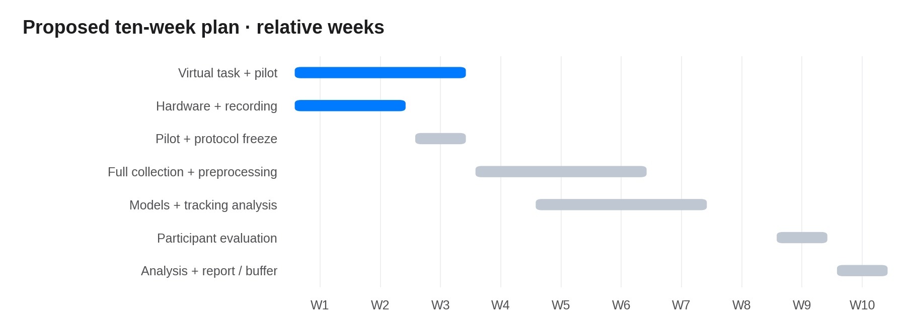
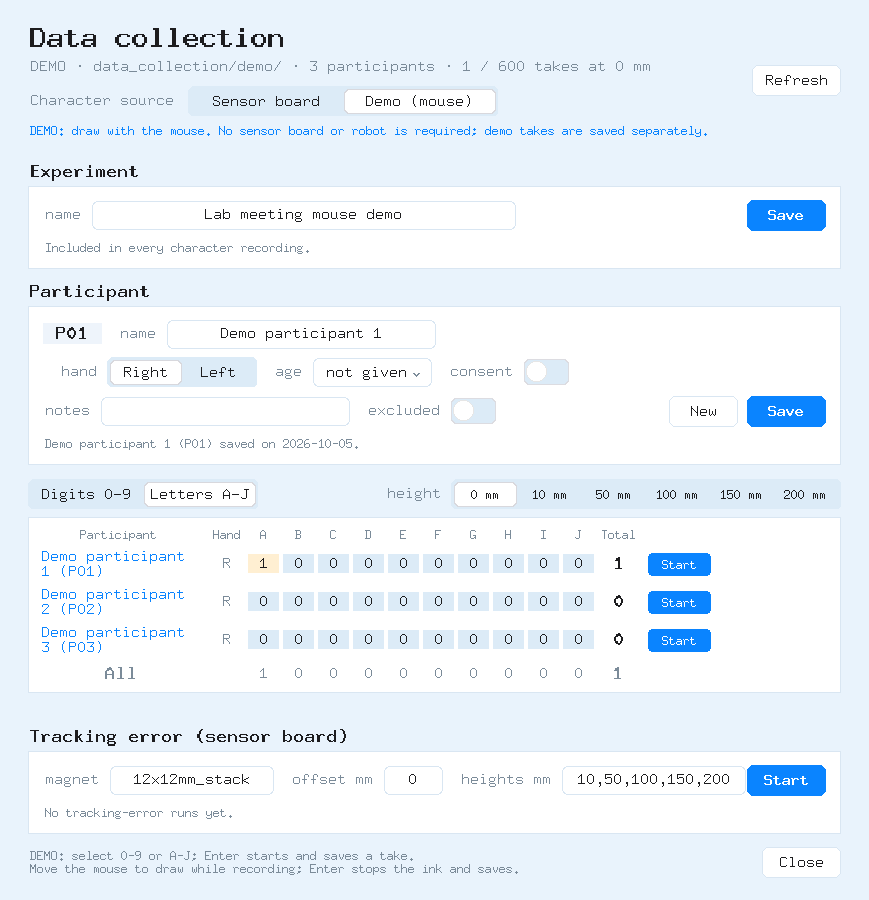

# Week 1 — MagPilot lab update

**5 October 2026 · `paper` branch** · [Two-page PDF](MagPilot_Lab_Update_2026-10-05.pdf) · [Editable Word report](MagPilot_Lab_Update_2026-10-05.docx)

## Completed

- Shared protocol: **0–9 / A–J**, ten takes per character (200 per participant).
- Participant names/stable IDs; experiment names stored with takes.
- Operator **Enter** starts/stops recording; participant only draws. Frozen samples produce matched CSV/PNG/JSON.
- Mouse demo files/counts stay separate from sensor recordings. Collection checks and GUI rehearsal passed.
- **Sensor board repaired. Three smaller magnets received.**

## Meeting decision and immediate priority

- Start the **virtual robot-arm target-reaching task in Week 1**, because it is the main implementation risk.
- Log target and actual end-effector positions, completion time, endpoint error and unsuccessful trials.
- Pilot the task before formal participant evaluation; compare controller conditions using the same targets and starting pose.
- Initial recorder and launch instructions: [Virtual task pilot](../VIRTUAL_TASK_PILOT.md). Simulated-arm validation and participant results remain pending.

## Hardware and collection next

- Compare **one, two and three magnets**; record geometry, grade, orientation and stack arrangement.
- Check repaired-board data, raw signal/clipping, writing-gap performance and teleoperation range.
- Character pilot: **40–60 takes/person** (2–3 repetitions); myself + 1–2 colleagues. Not collected yet.
- Before formal collection: review/resume, preprocessing, fixed pen/cover and participant-separated train/validation/test splits.

## Proposed schedule

| Project weeks | Deliverable |
|---|---|
| **1–3** | **Virtual target-reaching task, logging and early pilot — start immediately.** |
| 1–2 | Hardware/pen comparison and reliable recording. |
| 3 | Character pilot; freeze setup/protocol. |
| 4–6 | Formal collection and preprocessing. |
| 5–7 | Recognition models and tracking analysis; refine the task in parallel. |
| 9 | Participant evaluation. |
| 10 | Analysis, paper/report and buffer. |

## Week 1 — launcher and recording

DEMO screenshots use fictitious participant names and synthetic mouse input.

Reference: [K&J Magnetics — magnetic moment and geometry](https://www.kjmagnetics.com/blog/magnetic-dipole-moment).
