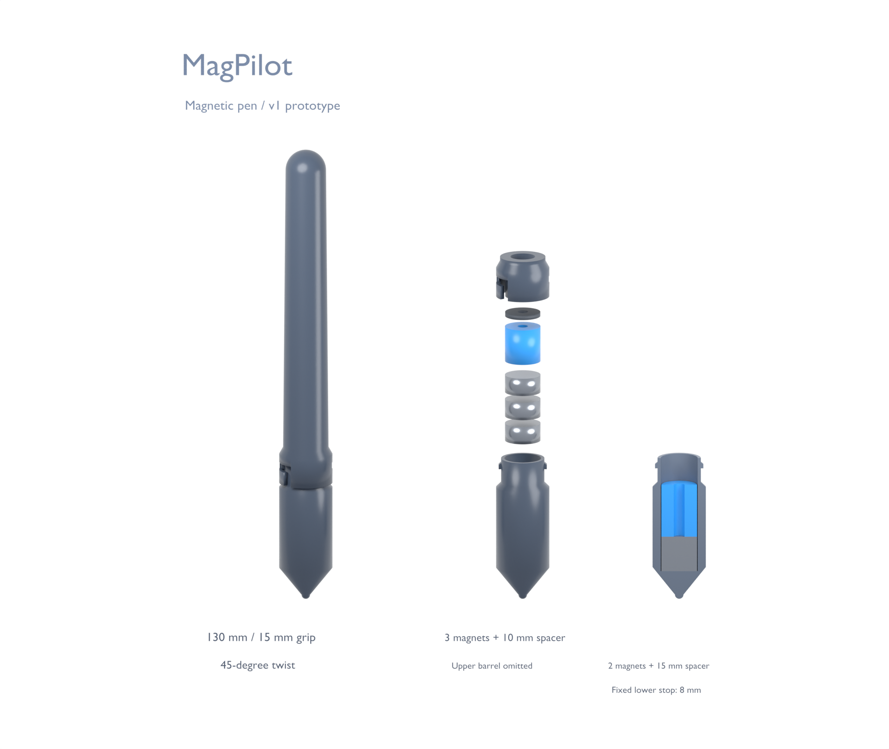

# Week 2 — MagPilot lab update

**5–11 October 2026 · meeting 12 October · draft as of 6 October**

[Two-page PDF](MagPilot_Lab_Update_2026-10-12.pdf) · [Editable Word report](MagPilot_Lab_Update_2026-10-12.docx)

## Week 2 — The teleoperation pipeline.

**Data pipeline**

- MuJoCo target-reaching lives in Data → Teleoperation Pipeline.
- Trackpad + board inputs; Enter starts; a stable 2 s hold saves.
- Participant progress; time, path and endpoint error logged.

**Next checks**

- Validate board mapping with the assembled pen.
- Rehearse identical targets and start pose for both inputs.

Implemented GUI · participant timing comparison not collected.

Priority for 12 October: a repeatable target-reaching pilot.

## Week 2 — Board repaired. Pen printing.

**Magnet diagnosis**

- Board repaired; 1/2/3 magnets × 3 repeats completed.
- Approx. 5 mm cardboard; placements by hand.
- One magnet: practical surface baseline; no accuracy winner established.

**Reloadable pen**

- 1–5 disks; spacers above shorter stacks.
- PLA printing started; fit and assembled tracking untested.

**Next checks**

- Check fit coupons and closure; measure pen geometry.
- Compare heights with a placement template, then freeze setup.

CAD prototype · print and tracking validation pending.

Surface tests do not validate operation at greater heights.

Tracking accuracy requires measured placement references; these hand-placed surface tests establish no accuracy ranking.

[Teleoperation protocol](../TELEOPERATION_COLLECTION.md) · [Pen CAD and printing](../../hardware/magnetic_pen_v1/README.md)
