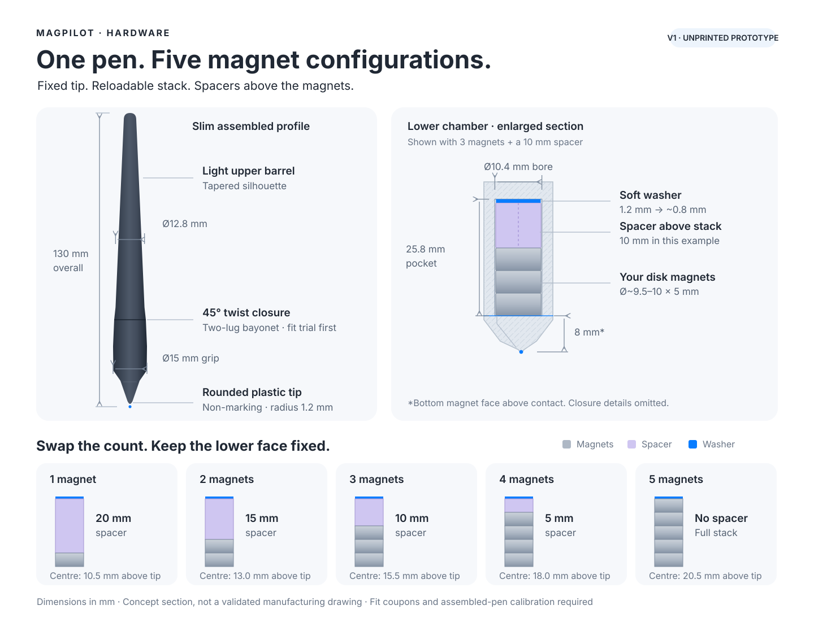

# MagPilot · Magnetic Pen v1

A slim, reloadable **non-marking stylus prototype** for 1–5 disk magnets. The fixed tip and lower stop keep the bottom magnet face in the same place; a spacer above a shorter stack fills the unused length.



[Rendered preview](preview.png) · [Dimensioned drawing · PDF](drawing.pdf) · [Printable STL set](stl/) · [Download bundle](magnetic_pen_v1.zip) · [Editable Blender model](magnetic_pen_v1.blend) · [Parameters](parameters.json) · [Build source](build_pen.py)

[K1 Max + eSUN PLA Basic · OrcaSlicer settings and supports](PRINTING_K1_MAX.md)

| Starting dimensions | mm |
|---|---:|
| Overall length | 130 |
| Grip / upper barrel diameter | 15 / 12.8 |
| Magnet diameter × thickness | approximately 9.5–10 × 5 |
| Magnet bore diameter | 10.4 |
| Bottom magnet face above tip contact | 8 |
| Loaded pocket length | 25.8 |
| Rounded plastic tip radius | 1.2 |

## Load the stack

1. Open the upper barrel with the **45° bayonet turn**.
2. Insert the magnets as one attracting stack against the fixed lower stop. Keep the same magnetic orientation between trials.
3. Add the matching spacer **above** the magnets, then the compressible washer.
4. Close the barrel. Confirm the stack stays still and the closure stays secure during a trial stroke.

| Magnets | Spacer above stack | Geometric stack centre above contact* |
|---:|---:|---:|
| 1 | 20 mm | 10.5 mm |
| 2 | 15 mm | 13.0 mm |
| 3 | 10 mm | 15.5 mm |
| 4 | 5 mm | 18.0 mm |
| 5 | None | 20.5 mm |

The **1.2 mm soft washer** is designed to compress to approximately 0.8 mm with the cap fully seated, or about 1.0 mm with its 0.2 mm retained axial play. Prefer cut soft foam or a sufficiently compliant elastomer. Measure the disks and check actual closing force; a solid PLA/PETG washer will not fit this loaded pocket.

*These are geometry values for an upright pen with 5 mm disks. The firmware's estimated magnetic position can differ; changing the count still requires calibration. Spacers preserve the bottom face, **not the stack centre**.

## Print a fit trial first

- Measure the actual disks with calipers. Start with `bore_fit_coupon.stl` and the two closure fit coupons before printing the full pen. The 58 × 17 × 7.2 mm bore block has four blind holes: Ø10.0 / 10.2 / 10.4 / 10.6 mm from left to right, with the orientation notch at the lower-left corner and a 1.2 mm floor.
- Rigid parts: PLA or PETG for the trial. Use cut soft foam or a compliant elastomer for the washer; test its compression and closing force. `washer_1p2mm.stl` is a geometry template, not a rigid part to print.
- Lower grip: magnet opening down, with a brim. Inspect the bridge over the 10.4 mm chamber in the slicer.
- Upper barrel: joint end down. Inspect the bayonet slots and internal pusher in the slicer.
- Spacers and washer: flat. Import all STLs as **millimetres**.
- This is an unprinted prototype. Tune bore, closure clearance and layer settings using the coupons; the initial dimensions are not a guaranteed printer fit. [Prusa's design guidance](https://help.prusa3d.com/article/modeling-with-3d-printing-in-mind_164135)

## Files and rebuild

The STL set contains the lower grip, upper barrel, 5/10/15/20 mm spacers, `washer_1p2mm.stl`, bore coupon, and two closure coupons. Magnets are separate hardware; do not print the reference magnets in the Blender scene.

From the repository root:

```bash
blender --background --factory-startup --python-exit-code 1 --python hardware/magnetic_pen_v1/build_pen.py
```

Edit `parameters.json` to adjust the measured magnet dimensions and fit clearances, then rebuild. `drawing.svg` is an annotated concept drawing; update its labels after changing dimensions.

## Check the assembled pen

- Re-test 1, 2 and 3 magnets in this housing: its 8 mm contact-to-magnet offset differs from the earlier bare-stack surface test.
- Use a fixed stack during participant collection and record its count and magnetic orientation.
- Test additional heights before choosing a teleoperation configuration; CAD accommodates 4–5 disks, but their tracking performance is untested.
- The board's **140 × 140 mm screw pattern** can support a separate height jig once screw size, clearance and measured sensor-to-surface spacing are confirmed. That jig is outside this pen model.
